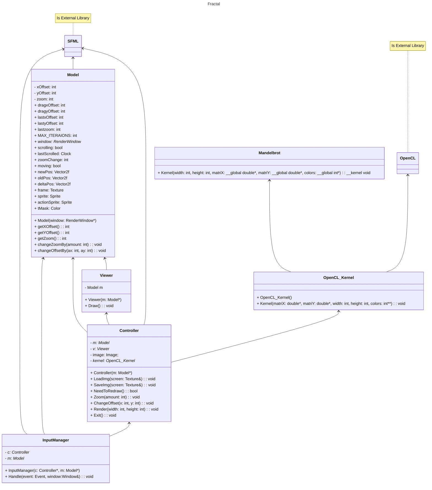

# Fractal
This project is a program written in C++ that can calculate the Mandelbrot set and display it on the screen. The program has the ability to zoom in and move around the set to explore its details. The implementation uses standard algorithms and formulas to accurately calculate the patterns that make up the set. The program is user-friendly and offers an immersive experience for those interested in exploring the Mandelbrot set.

## Libraries
- Simple and Fast Multimedia Library (SFML)
- Open Computing Language (OpenCL™)

## UML

